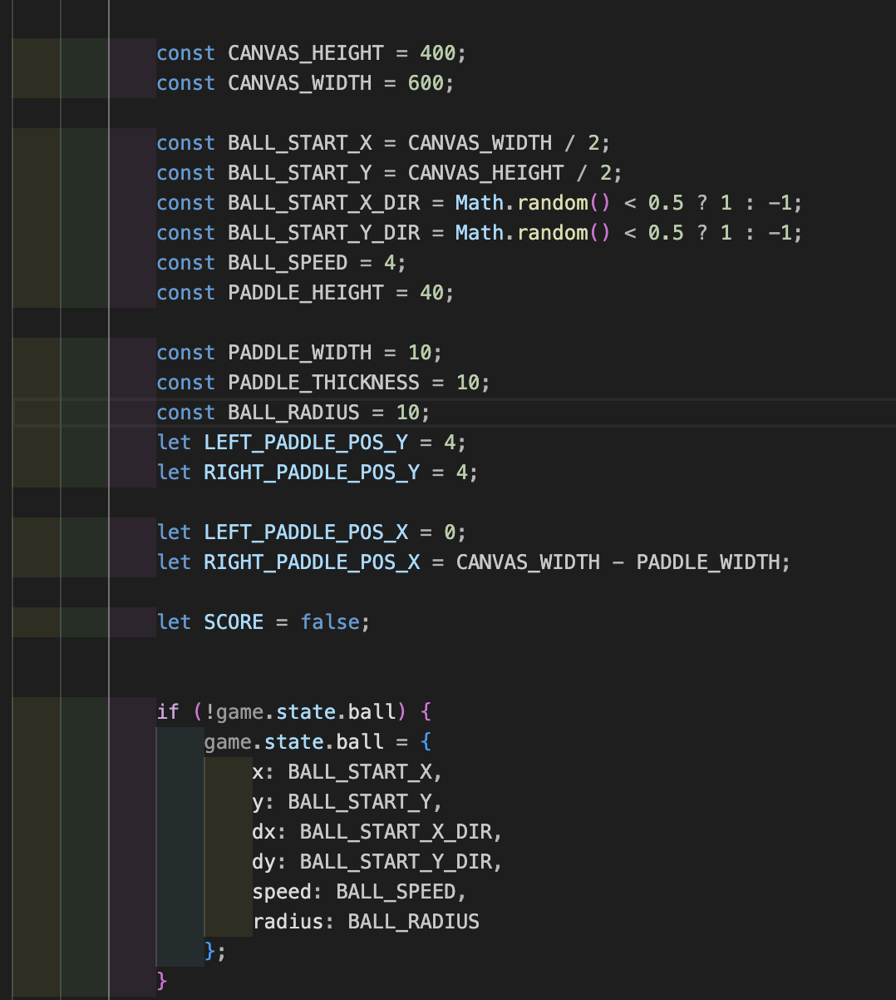

  
  

<a  id="readme-top"></a>

  
  

<br  />

  

<div  align="center">

  

<a  href="https://github.com/jxmijuholx/kollaboraatioterminaali.git">

  


  

</a>


<h3  align="center">Kollabterm</h3>

  

  

<p  align="center">

  

Kollabterm is a terminal and web based version of the classic Pong game that is meant for people who are stuck in a gaming queue and want to do something with their friends while waiting for a game. So queue up, and take a 1v1 with your friend while waiting!

  

<br  />

  

<a  href="https://github.com/jxmijuholx/kollaboraatioterminaali.git"><strong>Explore the docs »</strong></a>

  

  

<!-- TABLE OF CONTENTS -->

  

<details>

  

<summary>Table of Contents</summary>

  

<ol>

  

<li>

  

<a  href="#about-the-project">About The Project</a>

  

<ul>

  

<li><a  href="#built-with">Built With</a></li>

  

</ul>

  

</li>

  

<li>

<a  href="#getting-started">Getting Started</a>

  

<ul>

  

<li><a  href="#prerequisites">Prerequisites</a></li>

  

<li><a  href="#installation">Installation</a></li>

  

</ul>

  

</li>

  

<li><a  href="#usage">Usage</a></li>

  

<li><a  href="#contributing">Contributing</a></li>

  

<li><a  href="#license">License</a></li>

  

<li><a  href="#contact">Contact</a></li>

  

<li><a  href="#acknowledgments">Acknowledgments</a></li>

  

</ol>

  

</details>

  

  

<!-- ABOUT THE PROJECT -->

  

## About Kollabterm

  

### Features

 Real time Pong game with a friend

User creation and login

Terminal based chat with your opponent

<p  align="right">(<a  href="#readme-top">back to top</a>)</p>

  

### Built With

 React

 Node.js

 Express

 WebSockets

 MongoDB

  

  

<p  align="right">(<a  href="#readme-top">back to top</a>)</p>

  

  
  

<!-- GETTING STARTED -->

  

## Getting Started

  

To get a local copy up and running follow these simple example steps.

  

  

### Prerequisites

  

* npm

  

```sh

  

npm  install  npm@latest  -g

  

```

  
  

### Installation

  

```sh

git  clone  https://github.com/jxmijuholx/kollaboraatioterminaali

cd  kollaboraatioterminaali

cd  server  &  npm  i  &  npm  run  dev

cd  ../frontend  &  npm  i  &  npm  run  dev

Visit  the  frontend  localhost!

```

  

<p  align="right">(<a  href="#readme-top">back to top</a>)</p>

  

  

<!-- USAGE EXAMPLES -->

  

## Usage

  

#### This is how you use the deployed version of our game:

  

1. Go to https://kollabterm.fly.dev/

2. Create an account

3. Log in

4. Create a new game

5. Copy and paste the name of the game to your friend

6. Both of you now can join the newly created game sessiob by pasting the name of the game to the join game

7. Play pong or just chat!

  

<p  align="right">(<a  href="#readme-top">back to top</a>)</p>

  

### Code snippets

  #### Register a user


#### How the server handles requests


#### Create a game


#### This is what making a game looks like



  

#### Github Actions workflow

  

```

name: Deploy and Test

  

  

on:

  

push:

  

branches:

  

- main

  

pull_request:

  

types:

  

- closed

  

branches:

  

- main

  

  

concurrency:

  

group: ${{ github.workflow }}-${{ github.ref }}

  

cancel-in-progress: true

  

  

jobs:

  

deploy-and-test:

  

if: github.event.pull_request.merged == true

  

runs-on: ubuntu-latest

  

steps:

  

- name: Checkout repository

  

uses: actions/checkout@v4

  

  

- name: Checkout repository

  

uses: actions/checkout@v4

  

  

- name: Setup Node.js

  

uses: actions/setup-node@v4

  

with:

  

node-version: '20.11.1'

  

- name: Install dependencies and build UI

  

run: |

  

cd frontend

  

npm ci

  

npm run build

  

cd ../server

  

npm ci

  

  

- name: Install Fly CLI

  

run: |

  

curl -L https://fly.io/install.sh | sh

  

export PATH="$HOME/.fly/bin:$PATH"

  

echo "$HOME/.fly/bin" >> $GITHUB_PATH

  

  

- name: Deploy to fly.io

  

env:

  

FLY_API_TOKEN: ${{ secrets.FLY_API_TOKEN }}

  

run: |

  

cd frontend

  

rm -rf dist

  

npm run build

  

cd ../server

  

npm run deploy

  

- name: Wait for deployment

  

run: sleep 30

  

  

- name: Setup and run Playwright tests

  

run: |

  

cd server

  

cd e2e-tests

  

npm ci

  

npx playwright install --with-deps

  

npx playwright test

  

  

- name: Upload test results

  

if: always()

  

uses: actions/upload-artifact@v4

  

with:

  

name: playwright-report

  

path: e2e-tests/playwright-report/

  

retention-days: 30

```

<!-- CONTRIBUTING -->

  

## Contributing

  

  

Contributions are what make the open source community such an amazing place to learn, inspire, and create. Any contributions you make are **greatly appreciated**.

  

  

If you have a suggestion that would make this better, please fork the repo and create a pull request. You can also simply open an issue with the tag "enhancement".

  

Don't forget to give the project a star! Thanks again!

  

  

1. Fork the Project

  

2. Create your Feature Branch (`git checkout -b feature/AmazingFeature`)

  

3. Commit your Changes (`git commit -m 'Add some AmazingFeature'`)

  

4. Push to the Branch (`git push origin feature/AmazingFeature`)

  

5. Open a Pull Request

  

  

<p  align="right">(<a  href="#readme-top">back to top</a>)</p>

  

  

### Top contributors:

  

  

<a  href="https://github.com/jxmijuholx/kollaboraatioterminaali/graphs/contributors">

  


  

</a>

  

  

<!-- LICENSE -->

  

## License

  

  

Distributed under the MIT License. See `LICENSE` for more information.

  

  

<p  align="right">(<a  href="#readme-top">back to top</a>)</p>

  

  

<!-- CONTACT -->

  

## Contact

  

  

Jami Juhola - jami.juhola01@gmail.com

  

Your Name - email@email_client.com

  

Your Name - email@email_client.com

  

Your Name - email@email_client.com

  

  

Project Link: [https://github.com/jxmijuholx/kollaboraatioterminaali](https://github.com/jxmijuholx/kollaboraatioterminaali)

  

  

<p  align="right">(<a  href="#readme-top">back to top</a>)</p>

  

  

<!-- ACKNOWLEDGMENTS -->

  

## Acknowledgments

  
  

*  [Fly.io](https://fly.io/)

  

*  [Playwright](https://playwright.dev/)

  

*  [Vite](https://vite.dev/)

* Our teachers + fellow students who commented on our product and helped make it better!

  

  

<p  align="right">(<a  href="#readme-top">back to top</a>)</p>

  

  

<!-- MARKDOWN LINKS & IMAGES -->

  

<!-- https://www.markdownguide.org/basic-syntax/#reference-style-links -->

  

[contributors-url]:  https://github.com/jxmijuholx/kollaboraatioterminaali/graphs/contributors

  

[stars-url]:  https://github.com/jxmijuholx/kollaboraatioterminaali/stargazers

  

[issues-url]:  https://github.com/jxmijuholx/kollaboraatioterminaali/issues

  

[product-screenshot]:  images/screenshot.png

  

[React.js]:  https://img.shields.io/badge/React-20232A?style=for-the-badge&logo=react&logoColor=61DAFB

  

[React-url]:  https://reactjs.org/